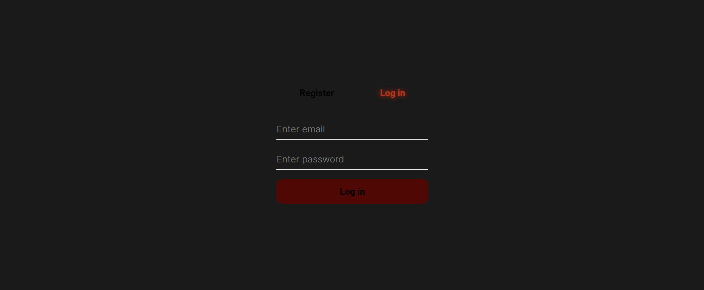
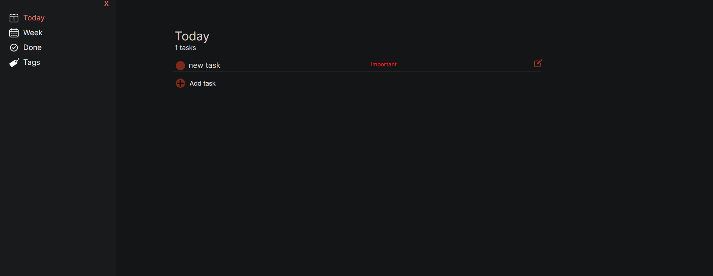
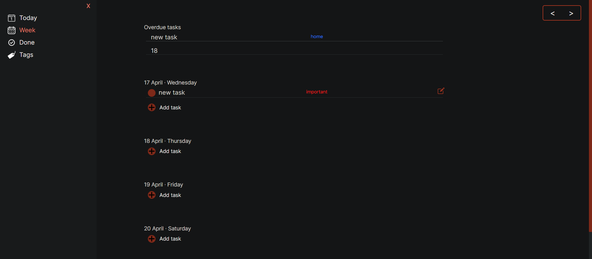
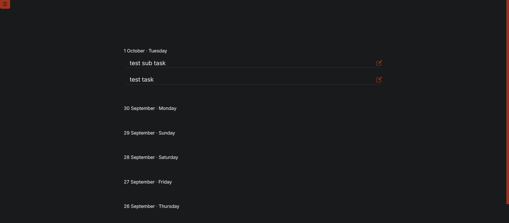
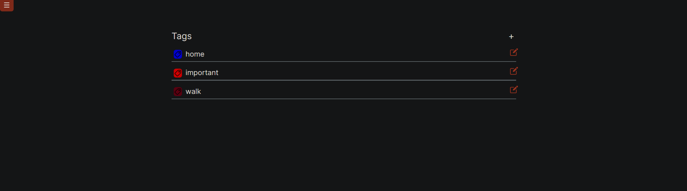

# ToDoList App

### Overview
A to-do list app that can create, read, update, delete and mark completed tasks. You can also add tags and dates to tasks. The frontend is developed using React and the [backend](https://github.com/StudentPP1/To-do-list-backend) is developed using Spring Boot.

### How to Run Application
   The project is hosted on [render.com](https://render.com/), so it is available at the [link](https://to-do-list-frontend-wj7x.onrender.com)

   

### Snapshot of Application

